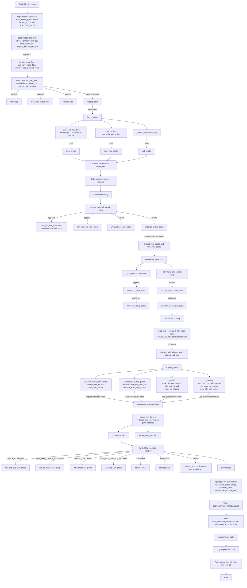

```mermaid
flowchart TD
    A0[Start vid_mkv_scan] --> A1[Import media types via load_media_types; derive VIDEO_EXTS and SUBTITLE_EXTS]
    A1 --> B1[Resolve roots and args; choose primary_root; set base_output_dir; ensure_dir if not dry_run]
    B1 -->|log setup| B2[Init lists: mkv_files, non_mkv_video_files, subtitle_files, skipped_rows]
    B2 --> C1[Walk roots via _iter_files; exclude base_output_dir; bucket by extension]
    C1 -->|append| C2[mkv_files]
    C1 -->|append| C3[non_mkv_video_files]
    C1 -->|append| C4[subtitle_files]
    C1 -->|append skipped| C5[skipped_rows]
    C5 -->|log counts| D0[Probe phase]

    D0 --> D1[_probe_list mkv_files; mkvmerge -J to tracks or failure]
    D0 --> D2[_probe_list non_mkv_video_files]
    D0 --> D3[_probe_list subtitle_files]
    D1 -->|push| E1[mkv_probe]
    D2 -->|push| E2[non_mkv_probe]
    D3 -->|push| E3[sub_probe]
    E1 & E2 & E3 --> F1[Collect failures into failed_files]
    F1 --> G1[Filter probes; remove failures]
    G1 --> H0[Subtitle matching]

    H0 --> H1[_match_external_subs by stem]
    H1 -->|append| H2[mkv_ext_sub_rows with video and matched subs]
    H1 -->|append| H3[non_mkv_ext_sub_rows]
    H1 -->|collect| H4[unmatched_subs_paths]
    H1 -->|derive| H5[matched_video_paths]
    H5 -->|remove matched videos| H6[pruned mkv_probe and non_mkv_probe]
    H6 --> I0[Non HEVC detection]

    I0 --> I1[_non_hevc on mkv rows]
    I0 --> I2[_non_hevc on non mkv rows]
    I1 -->|append| I3[mkv_non_hevc_rows]
    I2 -->|append| I4[non_mkv_non_hevc_rows]
    I3 -->|paths set| I5[mkv_non_hevc_paths]
    I4 -->|paths set| I6[non_mkv_non_hevc_paths]
    I6 --> J0[Classification setup]

    J0 --> J1[load_task_config vid_mkv_scan from configs/vid_mkv_scan/config.yaml]
    J1 -->|normalize| J2[allowed_vid, allowed_aud, allowed_sub lists]
    J2 --> K0[Classify rows]

    K0 --> K1[_classify mkv_probe tracks to mkv_files_ok and mkv_files_issues]
    K0 --> K2[_classify non_mkv_probe tracks to non_mkv_files_ok and non_mkv_files_issues]
    K0 --> K3[_classify mkv_ext_sub_rows to mkv_ext_ok and mkv_ext_issues]
    K0 --> K4[_classify non_mkv_ext_sub_rows to non_mkv_ext_ok and non_mkv_ext_issues]
    K1 & K2 & K3 & K4 -->|log classification totals| L0[Non HEVC reassignment]

    L0 --> L1[_move_non_hevc to *_issues_non_hevc when path matches]
    L1 --> L2[issues_non_hevc lists]
    L1 --> L3[updated ok lists]

    L3 --> M0[Write CSV reports if enabled]
    L2 --> M0
    M0 -->|TRACK_COLUMNS| M1[mkv_ext_sub CSV group]
    M0 -->|NON_MKV_TRACK_COLUMNS| M2[vid_ext_subs CSV group]
    M0 -->|TRACK_COLUMNS| M3[mkv_files CSV group]
    M0 -->|NON_MKV_TRACK_COLUMNS| M4[vid_files CSV group]
    M0 -->|conditional| M5[failures CSV]
    M0 -->|conditional| M6[skipped CSV]
    M0 -->|record| M7[written_reports dict with paths and rows]
    M0 --> N0[Summaries]

    N0 --> N1[Aggregate for summaries: file_counts, actual_langs, summary_rows, unmatched_subtitle_files]
    N1 --> N2[Write scan_summary_timestamp.txt]
    N2 --> N3[Write scan_summary_timestamp.html with tables and CSV links]
    N3 --> O0[Log summary paths]
    O0 --> O1[Log elapsed seconds]
    O1 --> O2[Return mkv_files_ok plus mkv_ext_ok]
    O2 --> O3[End]
```
